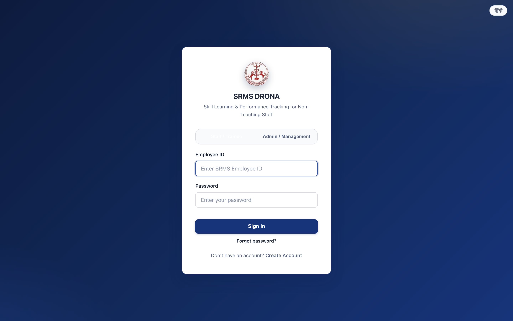
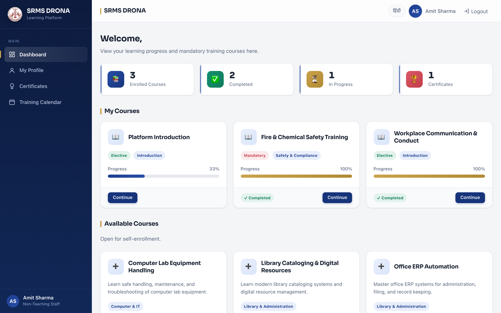
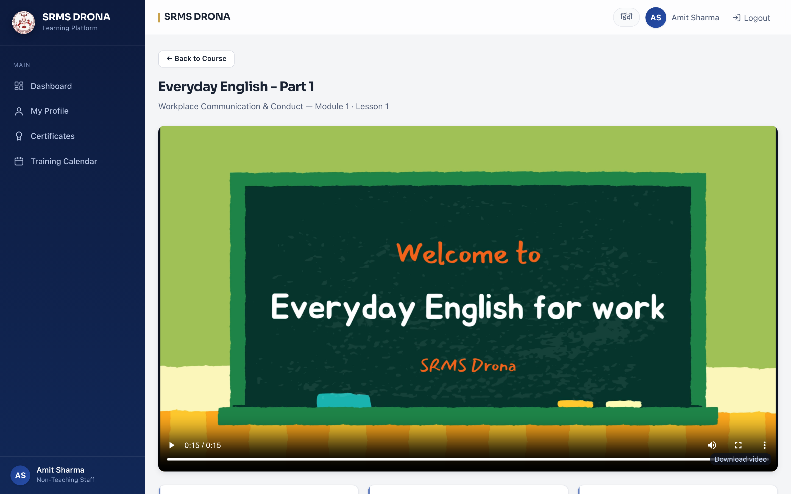
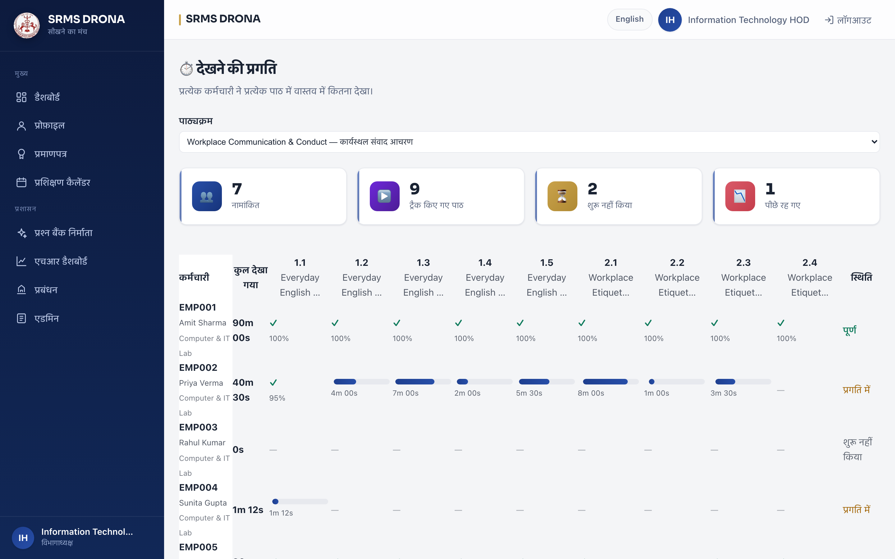
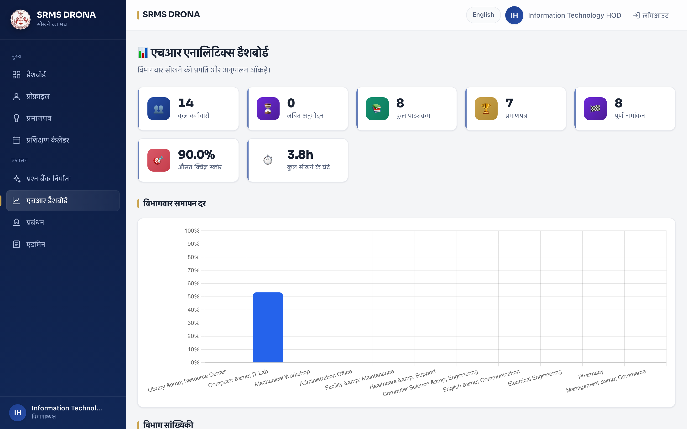
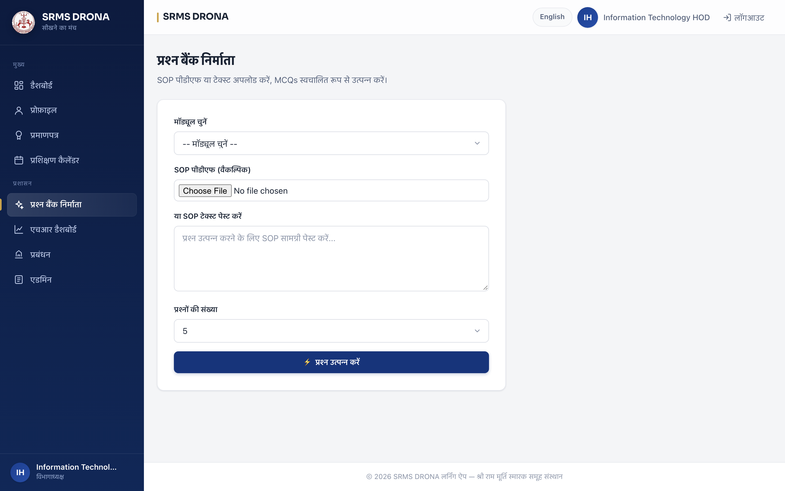
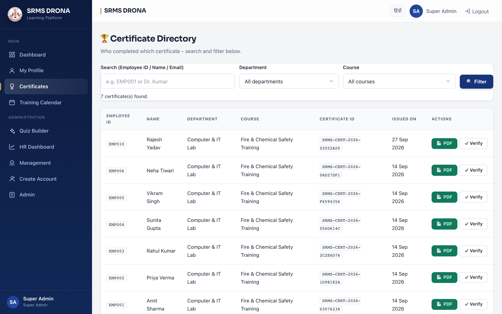
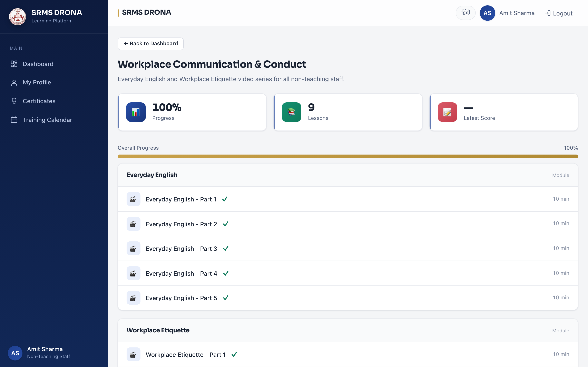

# DRONA — Staff Learning & Training Platform

A training portal for the **non-teaching staff** of SRMS Group of Institutions. Staff watch short
SOP videos, take quizzes, earn QR-verifiable certificates, and see what training is still pending.
Their Head of Department and the Super Admin build courses and track progress.

**Django 6.0.8 · Python 3.12 · PostgreSQL · 203 tests · 0 dependency advisories · English/हिन्दी**

| | |
|---|---|
| **Live app** | <https://dronav2.onrender.com> |
| **Sign in** | <https://dronav2.onrender.com/login/> |
| **Source** | <https://github.com/dgexplores/DRONA> |
| **Project report** | [`report3.0.docx`](docs/report/report3.0.docx) · [PDF](docs/report/report3.0.pdf) — 51 pages |
| **Presentation** | [`finalppt.pptx`](docs/presentation/finalppt.pptx) · [PDF](docs/presentation/finalppt.pdf) — 10 slides |

---

## Screens

All 38 live captures live in [`images_project/`](images_project/), grouped by the role that can
reach each screen. A selection:

| | |
|---|---|
|  |  |
|  |  |
|  |  |
|  |  |

**Bilingual** — the same screens in हिन्दी, which is the evidence the translation layer is real:

| | |
|---|---|
|  |  |

| Folder | Count | What |
|---|---|---|
| [`01-public/`](images_project/01-public/) | 5 | Login · register · password reset · 404 · public certificate verify |
| [`02-staff/`](images_project/02-staff/) | 8 | Dashboard · profile · certificates · calendar · course · video lessons · quiz |
| [`03-hindi/`](images_project/03-hindi/) | 3 | The bilingual layer, in Hindi |
| [`04-hod/`](images_project/04-hod/) | 11 | Analytics · watch-progress · console · courses · enrol · sessions · roster import · AI quiz builder |
| [`05-admin/`](images_project/05-admin/) | 11 | Certificate directory · all-department analytics · account, course, module and lesson editors |

Indexed with what each screen demonstrates: [`images_project/README.md`](images_project/README.md).

---

## Run it locally

```bash
git clone https://github.com/dgexplores/DRONA.git && cd DRONA
python3 -m venv venv && source venv/bin/activate
pip install -r requirements.txt
./venv/bin/python manage.py migrate && ./venv/bin/python seed.py
./venv/bin/python manage.py runserver        # http://127.0.0.1:8000/
```

Local logins: `ADMIN001` / `ADMIN001` (admin) · `HOD_IT` / `HOD_IT` (HOD) · `EMP001` / `drona123`
(staff). Published on purpose — the repository is public, and these match **no** live account.
The Hindi catalog is committed, so no `gettext` install is needed.

**Live logins are different.** The deployed site is locked down: 14 unique generated passwords,
none published. The operator reads them from the macOS keychain —
`security find-generic-password -a EMP001 -s DRONA -w`.

---

## What a user gets

| Role | Screens |
|---|---|
| **Staff** | Assigned courses · video lessons that resume where they stopped · quizzes (70% pass, retries) · certificate download · installable PWA |
| **Head of Department** | Management console: create courses, upload lessons, edit the training calendar, enrol by department or individually, approve sign-ups, HR analytics |
| **Super Admin** | Everything an HOD can do, plus creating HOD accounts and a platform-wide certificate directory with search and filters |

**Try these live** — all need a login first.

| | |
|---|---|
| Course 9 — Workplace Communication & Conduct | [`/courses/9/`](https://dronav2.onrender.com/courses/9/) |
| HR dashboard | [`/analytics`](https://dronav2.onrender.com/analytics) |
| Watch-progress report (per lesson, CSV export) | [`/analytics/watch-progress/`](https://dronav2.onrender.com/analytics/watch-progress/) |
| Certificate verification | `/verify/<id>/` — reached by scanning the QR code on a certificate, not by guessing URLs |

> Login is rate-limited to 5 attempts / 5 minutes per IP.

---

## Three things worth a closer look

- **Progress cannot be forged.** Watch position is saved on a 10s heartbeat, and lesson
  completion is **derived server-side** from accumulated watch time (90% of duration). Posting
  `completed: true` from the console earns nothing — there is a named regression test for it.
- **Three real vulnerabilities were found by attacking our own controls** — a stored XSS on media
  routes, missing security headers on exactly the routes that echo uploader bytes, and a rate
  limiter bypassable with a client-controlled header. All fixed, each with a test.
  Write-ups: [`ENGINEERING.md`](ENGINEERING.md).
- **Bilingual throughout.** 402 catalogued UI strings, plus `_hi` fields on course, module, lesson
  and quiz content — not just navigation, but validation messages and every error page.

## Architecture at a glance

| Layer | Choice |
|---|---|
| Backend | Django 6 · custom `StaffUser` (`USERNAME_FIELD = employee_id`) |
| Auth | Employee ID + password only, three roles `staff` → `hod` → `admin`. Argon2 hashing |
| Frontend | Server-rendered HTML · custom design system · vanilla JS · mobile-first |
| Database | PostgreSQL in production, SQLite for local |
| AI | Google Gemini — turns an SOP PDF into MCQs; falls back to rule-based with a logged warning |
| Certificates | ReportLab + `qrcode` — QR resolves to a public `/verify/<id>/` page |
| Media | Videos stored in the DB and served with HTTP Range so seeking works |
| Scheduling | APScheduler for training reminders |
| Hosting | Render + external Postgres; GitHub Actions for CI and a 5-minute keep-alive ping |

**Deliberate omissions** — email delivery needs SMTP credentials the service doesn't have, so mail
logs a warning instead of pretending to send. YouTube as a video source is deferred. Both are
written up in [`ROADMAP.md`](ROADMAP.md) with the reasoning.

---

## Working on it

```bash
./venv/bin/python manage.py test apps --settings=srms_dorna.test_settings
```

203 tests covering auth, RBAC, the approval flow, rate limiting, quizzes, certificates, the
certificate directory, course assignment, calendar gating and analytics — plus a named regression
test for every defect in [`ENGINEERING.md`](ENGINEERING.md). Tests write PDFs to a temp directory,
so a run leaves the working tree clean.

| Document | What it holds |
|---|---|
| [`docs/report/report3.0.docx`](docs/report/report3.0.docx) | **The project report** — 51 pages: requirements, methodology and techniques, modules, results, conclusion. [PDF](docs/report/report3.0.pdf) for viewing |
| [`docs/presentation/finalppt.pptx`](docs/presentation/finalppt.pptx) | **The presentation** — 10 slides covering problem, solution, architecture, the AI path, and deployment. [PDF](docs/presentation/finalppt.pdf) for viewing |
| [`ENGINEERING.md`](ENGINEERING.md) | Invariants, review checklist, and every trap this codebase has hit — **read before changing behaviour** |
| [`HANDOFF.md`](HANDOFF.md) | Deploy state, outstanding work, how to verify from the repo |
| [`ROADMAP.md`](ROADMAP.md) | Agreed-but-unbuilt work and why |
| [`images_project/`](images_project/) | 38 screenshots of every interface, indexed |
| [`render.yaml`](render.yaml) | Deployment config |

**Deploy note:** `render.yaml` is Blueprint-authoritative but **Auto Sync is off** — config
changes need a dashboard Sync; editing the file alone does nothing.

---

## License & usage

Internal educational project for SRMS Group of Institutions. Not for redistribution without
permission.
